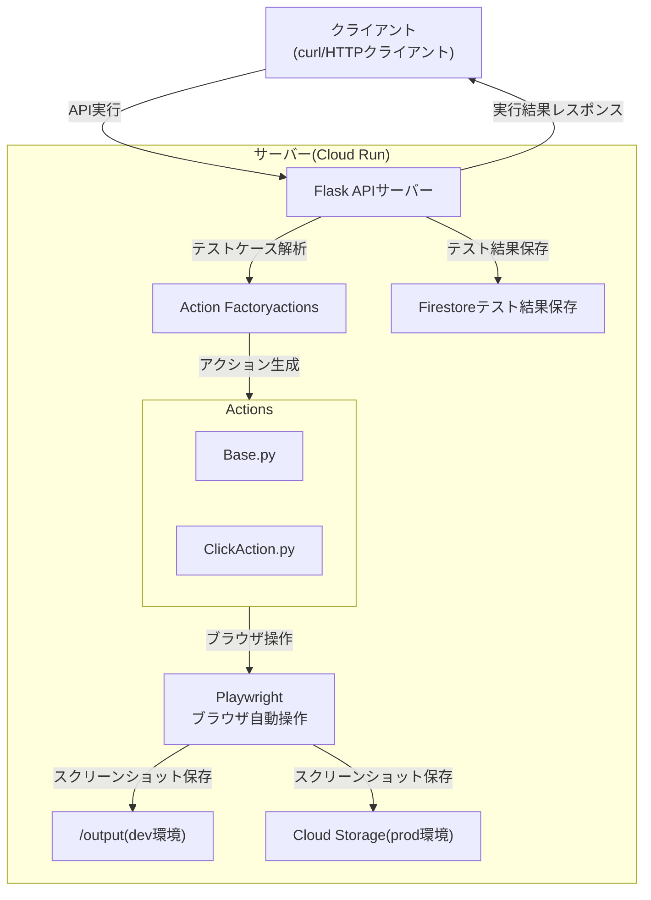

# 概要
このアプリはE2Eテストを支援するサーバーアプリです。APIで受け取ったテストケース情報をもとに、PlayWrightライブラリを使用してテストを実行し結果をレスポンスで返します。可能な限り簡単かつシンプルな構成を心がけて開発しています。

- ローカル: Dockerコンテナを起動しcurlコマンドでAPIをテストできます。
- リモート: `Cloud Run`上にデプロイして稼働します。スクリーンショットは`Cloud Storage`に、テスト結果は`Firestore`に保存します。

# 構成要素の整理
1. 環境・技術スタック
   1. 言語: python
   2. 実行環境: GoogleCloud
   3. HTTPサーバー: Flask
   4. E2Eテストライブラリ: Playwright
   5. 利用サービス: Cloud Run, Cloud Storage, Firestore

# テストケースのjson仕様
独自仕様のテストケースjsonを読み込み、パースしてそれぞれのactionを実行します。サポートしているアクションは以下の通りです。詳細仕様は`design_docs/`を参照のこと。

|    action name    |     内容     |
| ----------------- | ------------ |
| click             | ボタンなどの要素をクリックする |
| input             | 入力フィールドに何か入力する |
| screenshot        | 表示されている画面のスクリーンショットを取得する |
| scroll_into_view  | 指定要素までスクロールする |
| wait              | 指定秒数待機する |
| wait_for_selector | 画面に指定のセレクタが表示されるまで待機する |
| assert_exists     | 指定要素が存在するか？ |
| assert_text       | 指定要素のラベルが指定したテキストと一致するか？ |

# API仕様
1. テストケース実行: `/run_tests`
   1. メソッド: POST
   2. リクエストのパラメータ:
      1. テスト対象URL
      2. テスト対象サイトID
      3. テストケースID
      4. テストケース(jsonオブジェクト)
   3. レスポンス:
      1. 実行結果
2. テスト結果取得: `/get_results/<site_id>`
   1. メソッド: GET
   2. リクエストのパラメータ: なし
   3. レスポンス: テスト結果のリスト

## API認証
`Cloud Run`上にデプロイするとエンドポイントを知っていれば誰でも実行できます。しかし、第三者がこのAPIを実行しても特に盗用される情報はありません。そこでガチガチにセキュリティを固めることはせず最低限のセキュリティを担保する`API Key`を採用することにしました。

# テスト実行フロー図


# ユニットテスト
テストツールは`pytest`を使用しており、テストを書く対象（粒度）を分けて考えます。

|      テスト対象     | 内容 |
| ------------------ | ----- |
| 各アクションクラス | InputActionやClickActionなどのexecute関数の動作検証 |
| Factory         | 正しいクラスが返ってくるか（入力に応じて） |
| API(/run_tests) | curlで叩いたときに意図したレスポンスが返るか |

テストを実行する場合のコマンド
```sh
// 新たにライブラリを追加した場合
pip install -r requirements.txt

// ventで仮想環境を作っている場合
source .venv/bin/activate

// テスト実行
pytest tests/
```

# 動作確認手順
```
// イメージ作成
docker build -t e2e-server .

// サーバー実行
docker run --rm -p 8080:8080 -v $(pwd)/output:/output -e ENV=dev -e API_KEY=KEY12345 e2e-server

// サンプルのテストケース実行
curl -X POST http://localhost:8080/run_tests -H "Authorization: Bearer KEY12345" -H "Content-Type: application/json" -d @sample_test_case2.json

// テスト結果取得
curl -X GET http://localhost:8080/get_results/sample_site -H "Authorization: Bearer KEY12345"
```

# GoogleCloud Runへのサーバーデプロイ
```sh
# Cloud Buildでdockerイメージ作成
gcloud builds submit --tag asia-northeast1-docker.pkg.dev/[ProjectName]/[バケット名]/e2e-test-server

# Cloud Runにデプロイ
gcloud run deploy e2e-test-server \
 --image asia-northeast1-docker.pkg.dev/[ProjectName]/[バケット名]/e2e-test-server \
 --platform managed  \
 --region asia-northeast1  \
 --allow-unauthenticated  \
 --set-env-vars="API_KEY=XXX"  \
 --set-env-vars="ENV=prod" \
 --set-env-vars="CLOUD_STORAGE_BUCKET=YYYY"
```

# 備考
このプロジェクトはClineで実装しており、MemoryBank機能をカスタムして使っています。タスク完了時は以下の指示をしています。
```
update memory bank
```
