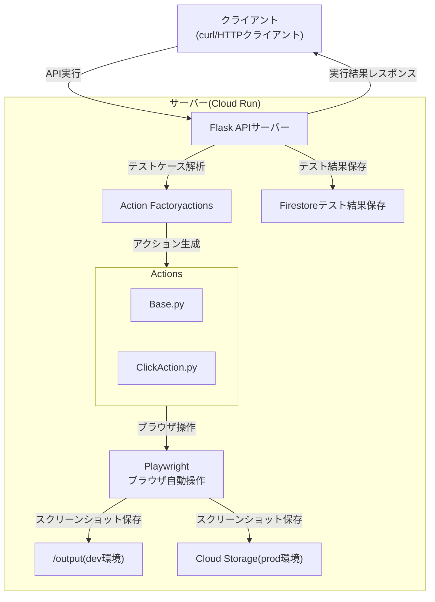

# 概要
このアプリはE2Eテストを支援するサーバーアプリです。APIで受け取ったテストケース情報をもとに、PlayWrightライブラリを使用してテストを実行し結果をレスポンスで返します。可能な限り簡単かつシンプルな構成を心がけて開発しています。

- ローカル: Dockerコンテナを起動しcurlコマンドでAPIをテストできます。
- リモート: `Cloud Run`上にデプロイして稼働します。スクリーンショットは`Cloud Storage`に、テスト結果は`Firestore`に保存します。

# 構成要素の整理
1. 環境・技術スタック
   1. 言語: python
   2. 実行環境: GoogleCloud
   3. HTTPサーバー: Flask
   4. E2Eテストライブラリ: Playwright
   5. 利用サービス: Cloud Run, Cloud Storage, Firestore

# ディレクトリ構成
project_root/  
├── app.py  
├── actions/  
│　　　├── base.py  
│　　　├── click.py   
│　　　└── ...  
├── tests/  
│　　　├── test_input_action.py  
│　　　├── test_click_action.py  
│　　　└── ...  
├── requirements.txt  
└── dockerfile  

- `actions/`: ここにアクションを1ファイルずつ分けて入れる
- `base.py`: 実装するアクションは必ずbase.pyを継承する
- `tests/`: アクションを実装したら必ずテストも実装する

# テストケースのjson仕様
独自仕様のテストケースjsonを読み込み、パースしてそれぞれのactionを実行します。actionの仕様は以下の通りです。サンプルのjsonが必要な場合は同ディレクトリの`sample_test_case.json`を確認してください。

|     要素名     |     内容     |
| ------------- | ------------- |
| action        | 実行する操作。input, click, wait, assertExists, assertText, screenshot, scroll_into_view |
| selector      | CSSセレクタ |
| value         | 入力値。inputアクション時のみ使用 |
| secondswait   | アクション時に待機する秒数 |
| exists        | assert時に要素が存在すべきかどうか(true/false) |
| timeoutMillis | タイムアウトをmsで指定。scroll_into_viewアクション時のみ使用。デフォルトは5秒。 |

# スクリーンショットの保存場所
スクリーンショットアクションを使うとスクリーンショットを取得し、`YYYYMMDDHHMMSS.png`というファイル名で保存します。保存先のディレクトリ仕様は以下のとおりです。

- ENVが"dev"の場合
  - Dockerコンテナ内の`/output/[siteId]/[日付]/[ファイル名]`に保存します。
- ENVが"dev"でない場合
  - `Cloud Storage`に保存します。

## Cloud Storageの仕様
- バケット名の取得
  - 環境変数`CLOUD_STORAGE_BUCKET`から取得します。この環境変数が設定されていない場合のデフォルト値は"e2e-test-screenshots"です。(config.py)
- 保存先
  - バケット内のパス（オブジェクト名）は`CLOUD_STORAGE_BUCKET/[siteId]/日付/ファイル名`という形式になります。

# API仕様
1. テストケース実行: `/run_tests`
   1. メソッド: POST
   2. リクエストのパラメータ:
      1. テスト対象URL
      2. テスト対象サイトID
      3. テストケースID
      4. テストケース(jsonオブジェクト)
   3. レスポンス:
      1. 実行結果
2. テスト結果取得: `/get_results/<site_id>`
   1. メソッド: GET
   2. リクエストのパラメータ: ー
   3. レスポンス: テスト結果のリスト

## API認証
`Cloud Run`上にデプロイするとエンドポイントを知っていれば誰でも実行できます。しかし、第三者がこのAPIを実行しても特に盗用される情報はありません。そこでガチガチにセキュリティを固めることはせず最低限のセキュリティを担保する`API Key`を採用することにしました。

# テスト実行フロー図


# テスト
テストツールは`pytest`を使用しており、テストを書く対象（粒度）を分けて考えます。

|      テスト対象     | 内容 |
| ------------------ | ----- |
| 各アクションクラス | InputActionやClickActionなどのexecute関数の動作検証 |
| Factory         | 正しいクラスが返ってくるか（入力に応じて） |
| API(/run_tests) | curlで叩いたときに意図したレスポンスが返るか |

テストを実行する場合のコマンド
```sh
// 新たにライブラリを追加した場合
pip install -r requirements.txt

// ventで仮想環境を作っている場合
source .venv/bin/activate

// テスト実行
pytest tests/
```

# 動作確認手順
```
// イメージ作成
docker build -t e2e-server .

// サーバー実行
docker run --rm -p 8080:8080 -v $(pwd)/output:/output -e ENV=dev -e API_KEY=KEY12345 e2e-server

// サンプルのテストケース実行
curl -X POST http://localhost:8080/run_tests -H "Authorization: Bearer KEY12345" -H "Content-Type: application/json" -d @sample_test_case2.json

// テスト結果取得
curl -X GET http://localhost:8080/get_results/sample_site -H "Authorization: Bearer KEY12345"
```

# GoogleCloud Runへのサーバーデプロイ
```sh
# Cloud Buildでdockerイメージ作成
gcloud builds submit --tag asia-northeast1-docker.pkg.dev/[ProjectName]/[バケット名]/e2e-test-server

# Cloud Runにデプロイ
gcloud run deploy e2e-test-server \
 --image asia-northeast1-docker.pkg.dev/[ProjectName]/[バケット名]/e2e-test-server \
 --platform managed  \
 --region asia-northeast1  \
 --allow-unauthenticated  \
 --set-env-vars="API_KEY=XXX"  \
 --set-env-vars="ENV=prod" \
 --set-env-vars="CLOUD_STORAGE_BUCKET=YYYY"
```

# 将来的に追加しても良いアクション
|      action名    |     内容     |
| ---------------- | ------------- |
| press_key        | エンターキーやタブなどのキー操作 |

# 備考
このプロジェクトはClineで実装しており、MemoryBank機能をカスタムして使っています。タスク完了時は以下の指示をしています。
```
update memory bank
```


# 過去の検討事項まとめ
## SeleniumとPlaywrightどちらを採用すべきか？
Playwrightの方が良い。WebDriverが不要だったり非同期処理に長けている。Microsoftが開発元なのも強い。
## FlaskかFastAPIか
すぐにシンプルな構成で始めたい場合はFlask、長期的に保守・拡張を視野に入れて非同期処理を前提にしたい場合はFastAPiが良いとのこと。
## テストケースのjsonはAPIで渡すべきか？ファイルにするべきか？
「開発スピード」と「疎結合な構成」を両立させたいなら、まずAで構築してBへの移行余地を残す設計（パラメータにjson or json_uri）が良いです。Playwrightコード側も、受け取るJSONの構造が一定ならファイルからでもインラインでも同じパース処理で使えるようにしておくのが望ましい。
したがって、あらかじめJSONを作っておいてRequestのパラメータで指定する。もしjsonが大きくなってきたらファイルパスを送ってE2Eテストサーバー側でファイルを見に行ってjsonをパースする方式にする可能性もある
## dockerfile
`playwright install --with-deps chromium`によって必要なブラウザと依存ライブラリがまとめてインストールされるので別途Chromeなどは不要。slimベースを使い不要なパッケージを避けている。（軽量化意識）Playwrightは自動的にヘッドレスモードで動作する（もちろん非ヘッドレスにも切り替え可）。あとでgunicornに差し替える余地を残しているが、今はFlaskの内蔵サーバーでOK。

